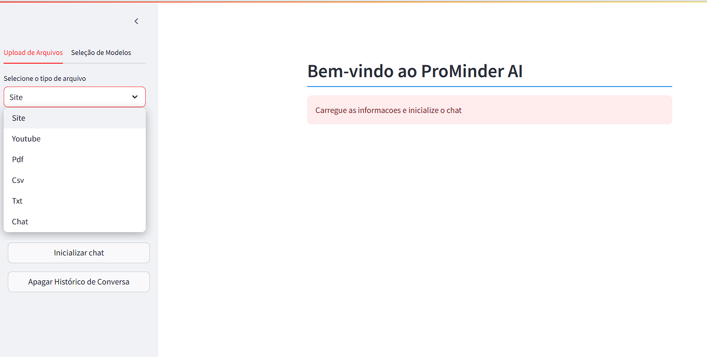
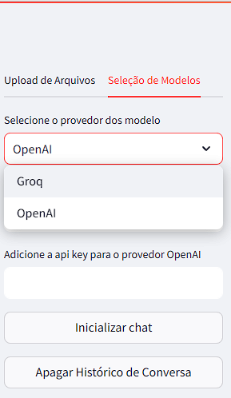
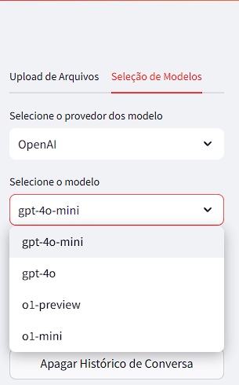

# ProMinder AI v1.0
Bem-vindo à ProM AI, um assistente inteligente projetado para interagir com diversos formatos de arquivos e responder perguntas de forma precisa e dinâmica. O ProM utiliza modelos de linguagem avançados e técnicas de processamento de dados para oferecer respostas baseadas em documentos fornecidos pelo usuário.



## Principais Vantagens

1. Flexibilidade na Escolha de Modelos de Linguagem
   * Integração com múltiplos provedores de IA, como OpenAI e Groq. *(Outros modelos serão disponibilizados em breve)*

   <br><br>

   
   <br>
   ___________________________________________________
   <br><br>

   * Suporte a diferentes modelos de linguagem, oferecendo opções que variam em precisão, custo e performance.
   
   <br>

   

   ___________________________________________________
  <br>

   * Adaptação às necessidades do usuário, como diálogos rápidos ou análises profundas.

2. Código Aberto e Extensível
   * Código disponível no GitHub, permitindo personalizações, melhorias e integração com outras ferramentas.
   * Uma base sólida para projetos mais avançados.

## Funcionalidades
* Suporte a múltiplos formatos de arquivos:
  * Sites
  * Vídeos do YouTube
  * PDFs
  * Arquivos CSV
  * Arquivos de texto (TXT)
* Integração com modelos de IA de provedores como OpenAI e Groq.
* Memória de conversação para continuidade do diálogo.
* Interface intuitiva construída com Streamlit.

## Pré-requisitos
Certifique-se de ter os seguintes itens instalados antes de iniciar o projeto:

1. Python 3.8 ou superior
2. Bibliotecas Python necessárias
   * Streamlit
   * LangChain
   * Outros pacotes como loaders específicos para arquivos (PDF, CSV, etc.).

Instale as dependências com o comando:
```python
pip install -r requirements.txt
```
3. Chave da API
   * Gere sua Chave da API para os provedores utilizados (OpenAi ou Groq).


## Como Usar
1. Clone o repositório
```python 
git clone https://github.com/seu-usuario/seu-repositorio.git
cd seu-repositorio
```

2. Inicialize o Streamlit
Execute o comando:

```python
streamlit run app.py
```
3. Carregue seu documento ou link

   * Na barra lateral, selecione o tipo de arquivo ou insira o link.
   * Faça upload do arquivo (PDF, CSV, ou TXT) ou forneça a URL para sites e vídeos do YouTube.

4. Configure o modelo

   * Escolha o provedor (e.g., OpenAI ou Groq).
   * Selecione o modelo desejado.
   * Insira a chave da API correspondente.

5. Interaja com o chat ProM AI

   * Use o campo de texto para enviar perguntas e obter respostas baseadas nos dados fornecidos.


## Funcionalidades Adicionais
* Versatilidade de Modelos: Alterne entre modelos e provedores conforme sua necessidade.
* Histórico de Conversas: O ProM mantém um registro de mensagens para garantir a continuidade do contexto.
* Reset de Memória: Reconfigure a memória a qualquer momento clicando no botão "Apagar Histórico de Conversa".

## Estrutura do Projeto

```python
.
├── app.py                  # Código principal
├── loaders/                # Módulos para carregar arquivos
├── requirements.txt        # Dependências do projeto
├── README.md               # Documentação do projeto
```

## Contribuição
Contribuições são bem-vindas! Sinta-se à vontade para abrir issues ou enviar um pull request.

1. Faça um fork do projeto.
2. Crie uma branch para sua funcionalidade:
```python
git checkout -b minha-funcionalidade
```
3. Faça commit das alterações:
```python
git commit -m "Descrição da funcionalidade"
```
4. Envie suas alterações:
```python
git push origin minha-funcionalidade
```
5. Abra um pull request.


